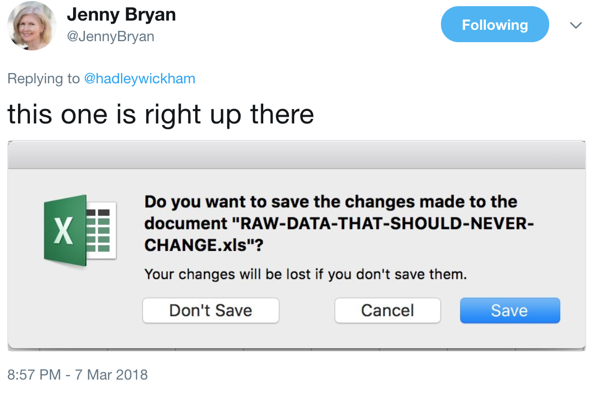
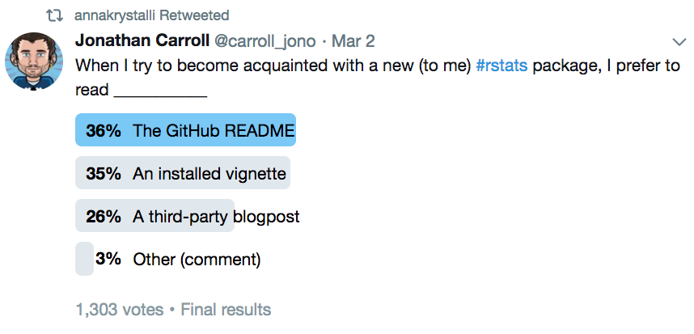
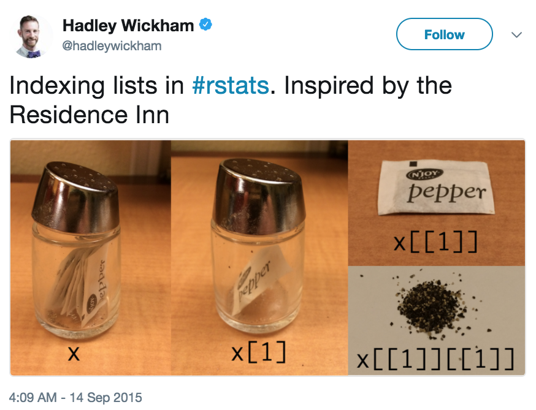

<!-- README.md is generated from README.Rmd. Please edit that file -->

Tweets
======

Twitter is a an excellent source of information and humour, but keeping track of tweets is a difficult business. Until I have a better solution this repo includes two things:

-   A screenshot of the tweet
-   A link, description and categorisation of the tweet in `tweet-index.csv`

The table below is generated by `knitr::kable` and shows the tweets in reverse canonical order:

|                                                                                                       Tweet                                                                                                       |                               Tweet description                               | Date of tweet |                                      Subject of tweet?                                     |
|:-----------------------------------------------------------------------------------------------------------------------------------------------------------------------------------------------------------------:|:-----------------------------------------------------------------------------:|:-------------:|:------------------------------------------------------------------------------------------:|
|                     <a href='https://twitter.com/JennyBryan/status/971490104723329025' target='_blank'></img></a>                    |   Tweet highlighting the bad practice of saving changes to raw data in Excel  |   2018-03-07  |                                                  |
| <a href='https://twitter.com/carroll_jono/status/969442252610191361' target='_blank'></img></a> | Poll asking where folks first look when becoming acquinted with a new package |   2018-03-02  |                                                |
|                 <a href='https://twitter.com/hadleywickham/status/643381054758363136' target='_blank'></img></a>                 |                Hadley's tweet about indexing and pepper shakers               |   2015-09-14  |   |

Note on screenshots
-------------------

Screenshots will be highly irregular as there is not Twitter provided API for converting Tweets to images.

Screenshots will differ in at least the following ways:

-   Operating System
-   Browser / Twitter application
-   Screen resolution
-   Position in feed Tweet is viewed
-   Pixel size of the image

Copyright
---------

The ownership of tweets, particularly the issue of copyright infringement, is a complicated business. Despite it not having any legal weight to it, I would like to make clear: *all rights belong to their respective copyright holders*.

Please contact me with an Issue or email (<martinjohnhadley@gmail.com>) if you would like your content to be removed.
